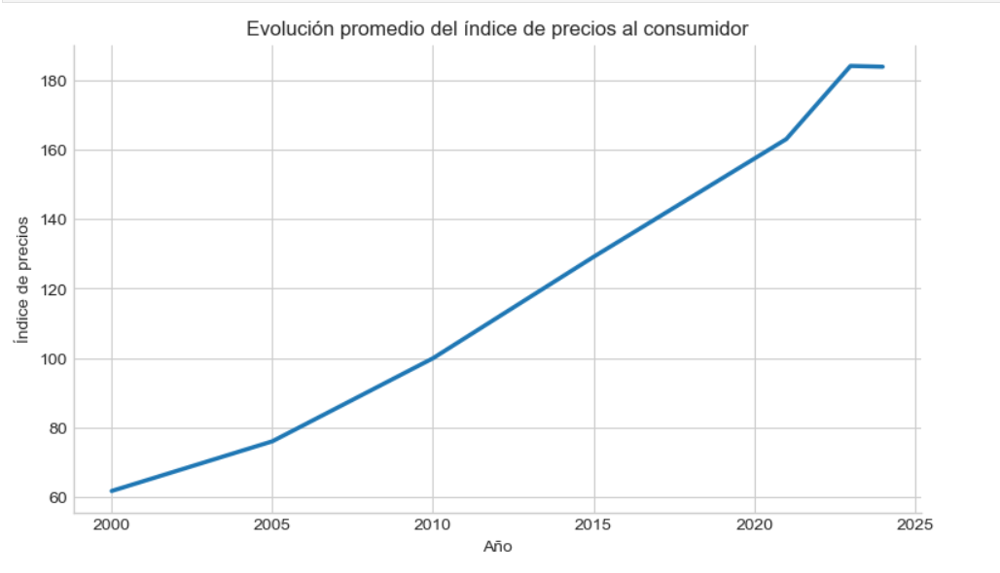
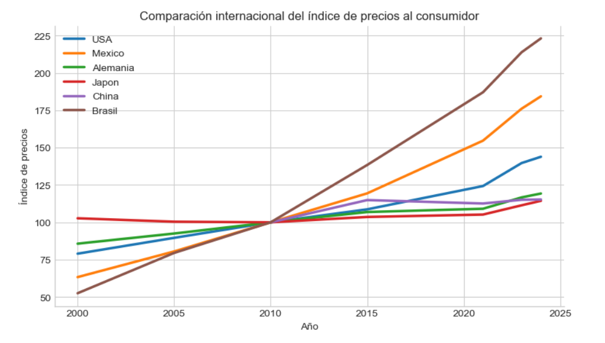
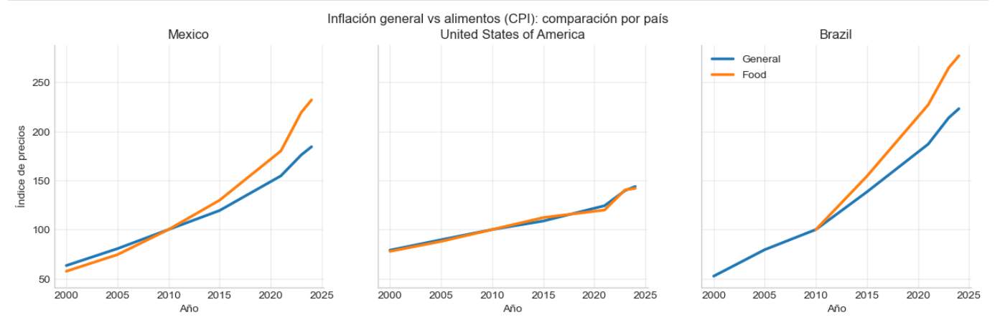
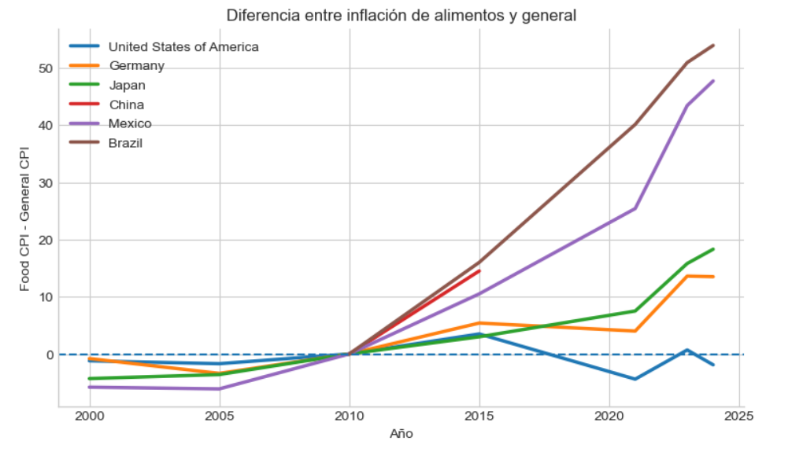

# Inflation Data Analysis

Exploratory data analysis of Consumer Price Index data from the United Nations.

## Objectives
- Analyze global inflation trends over time
- Compare CPI across countries
- Compare food inflation vs general inflation

## Tools used
- Python
- pandas
- matplotlib
- Jupyter Notebook

## Dataset
United Nations Data – Consumer Price Index (CPI)
## Visualizations

### CPI Trend

### International CPI Comparison

### Food vs General CPI

### Food CPI Difference

